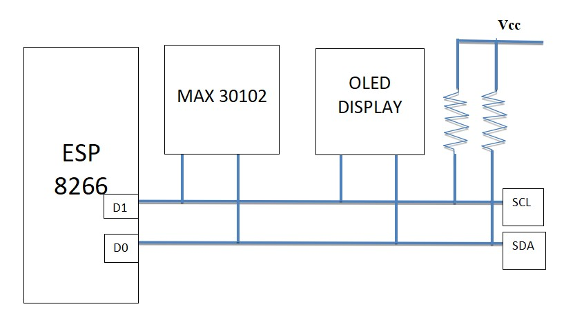
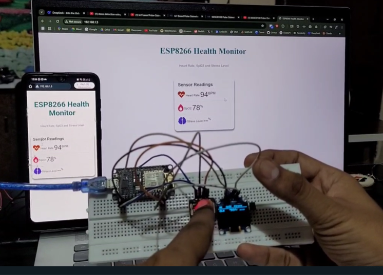
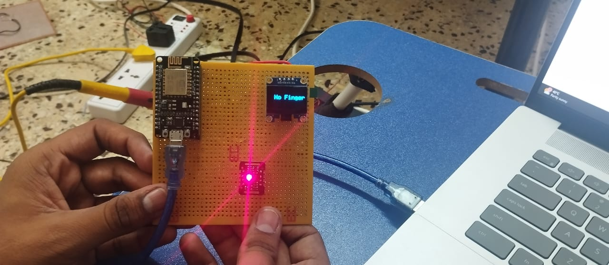

# Health-Monitoring-System
# Real-Time Stress Detection using ESP8266 & MAX30102
A compact, wireless, and affordable system to monitor stress levels in real-time using Heart Rate Variability (HRV), built with ESP8266 and the MAX30102 PPG sensor.

## 📑 Table of Contents
- [Features](#features)
- [System Overview](#system-overview)
- [How It Works](#how-it-works)
- [Results](#results)
- [References](#references)

## 🔧 Features
- Real-time heart rate and SpO₂ monitoring
- HRV calculation (SDNN, RMSSD) for stress detection
- OLED display output
- Wi-Fi connectivity for remote data monitoring
- Low-power design, suitable for wearable use

## 📐 System Overview

The system consists of:
- ESP8266 microcontroller
- MAX30102 sensor
- OLED Display
- 3.3V regulated power supply



## 🖥️ How It Works

1. MAX30102 collects heart rate and SpO₂ data via I2C.
2. ESP8266 processes the data to calculate HRV metrics.
3. Based on HRV (e.g., SDNN, RMSSD), it classifies stress levels.
4. OLED display shows the result. Wi-Fi can optionally transmit data to a mobile or web interface.

## 📊 Results

| Person No. | Pulse Oximeter Pulse Rate (BPM) | Pulse Oximeter O₂ Level (%) | Project Pulse Rate (BPM) | Project O₂ Level (%) |
|------------|----------------------------------|------------------------------|---------------------------|-----------------------|
| 1          | 76                               | 98                           | 78                        | 97                    |
| 2          | 82                               | 99                           | 84                        | 95                    |
| 3          | 70                               | 97                           | 71                        | 96                    |
| 4          | 91                               | 96                           | 89                        | 95                    |
| 5          | 65                               | 98                           | 67                        | 77                    |
| 6          | 88                               | 97                           | 90                        | 96                    |
| 7          | 72                               | 98                           | 73                        | 97                    |
| 8          | 95                               | 95                           | 93                        | 93                    |
| 9          | 68                               | 99                           | 70                        | 88                    |
| 10         | 86                               | 96                           | 87                        | 96                    |
| 11         | 74                               | 97                           | 78                        | 96                    |
| 12         | 80                               | 98                           | 77                        | 99                    |

> ✅ These results demonstrate that the stress detection system closely tracks real-world physiological parameters, showing minor deviations suitable for non-clinical use.






## 🚀 Installation / Getting Started

1. Clone this repo:
   ```bash
   git clone https://github.com/yourusername/stress-detection-esp8266.git

## 📚 References

- Shaffer & Ginsberg – Overview of HRV Metrics
- Daud Muhajir et al. – Android App for HRV-based Stress Monitoring
- MAX30102 Datasheet
- Project Report (see `/docs/project_report.pdf`)
